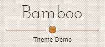
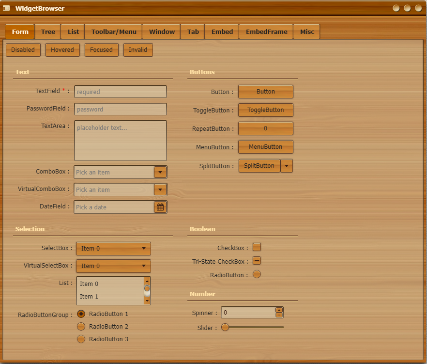

<!-- PROJECT LOGO -->
<br />
<p align="center">
  <a href="https://github.com/goldim/Bamboo">
    
  </a>

  <h3 align="center"></h3>

  <p align="center">
    A theme for the Qooxdoo JavaScript Framework
  </p>
</p>

<!-- ABOUT THE PROJECT -->
## About the &laquo;Bamboo&raquo; theme (v1.0)

This is another theme contribution which can be used with applications written in qooxdoo v3.0 or above. The theme has a "wooden" visual appeal which partly reminds me of bamboo, hence its name. It took ages to develop (more than three years), because this is a typical spare time project and finding/designing the bits and pieces suitable for creating a coherent overall appearance was quite a demanding task.

In contrast to my previous theme demos, the «Bamboo» demo application uses neither Oxygen nor Tango, but a slightly customized subset of the Font Awesome icons. However, instead of trying to make the awesome CSS/SVG mechanics work in a qooxdoo program I'm simply using PNG versions of the icons https://github.com/encharm/Font-Awesome-SVG-PNG.

**Form Controls**


<!-- GETTING STARTED -->
## Using the Theme in your Application
To use Bamboo in your application, go to the application root directory and install the theme into your project:
```sh
$ qx package update
$ qx package list
$ qx package install goldim/Bamboo
```
Now you just have to modify your compile.json to enable the theme:
```json
"applications": [
  {
    ...
    "theme": "bamboo.theme.Theme",
    ...
  }
],
```

<!-- LICENSE -->
## License

Distributed under the MIT License. See `LICENSE` file for more information.

<!-- CONTACT -->
## Contact

Norbert Schröder - [@scro34](http://scro34.de/) - email: n.schroeder@scro34.de
Dmitrii Zolotov - [@goldim](https://github.com/goldim) - email: zolotovdy@yandex.ru